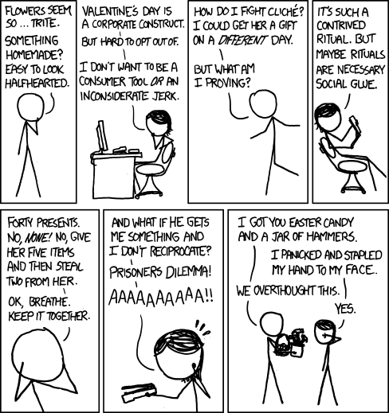

#### Game Theory and Iterated Prisoner's Dilemma in Python
[@MrSouravSingh](https://twitter.com/MrSouravSingh)

---

#### This comic brought me into Game Theory.


---

#### What is Game Theory?

Study Conflicts and Cooperation between various entities though Mathematical Models.

---

#### Let's Play!!

Let's play a small game to understand a bit on Game Theory- Guess 2/3rd of average.

The aim of the game is to guess the 2/3rd of the average of your guesses.

Numbers are restricted between 0 to 100, both inclusive.

---

#### Prisoner's Dilemma

- Started out as an idea at RAND Corporation.
- Formalized later by  Albert W. Tucker as a game with prison sentence rewards.

---

#### Scenario

- Two members of a criminal organization A and B are captured and put in incarceration. Both the members are isolated and  cannot communicate with each other.
- The Prosecutor doesn't have enough evidence for prosecution and decides to give each person a bargain- betray your friend or cooperate with your friend by going silent.

---

The offer is:
- If A and B betray each other, both get imprisonment for three years.
- If A betrays and B is silent(or vice versa),  A is free and B will serve 5 years in prison.
- If both remain silent, Both serve one year in prison.

---
### Payoff Matrix(Outcome of game playing between two players A and B)


---
#### More on Prisoner's Dilemma


Taken from [https://xkcd.com/1016/](https://xkcd.com/1016/)
---
#### Iterated Prisoner's Dilemma

1. Started out by Robert Axelrod as a student in 1962.
2. [Axelrod1980](http://citeseerx.ist.psu.edu/viewdoc/download?doi=10.1.1.665.7955&rep=rep1&type=pdf): 15 strategies
3. [Axelrod1980b](http://journals.sagepub.com/doi/abs/10.1177/002200278002400301): 65 strategies

---

### IPD in Python

---

### Basic Strategy for IPD

```python
class TitForTat(Player):
    """A player starts by cooperating and then mimics previous move by opponent."""

    name = 'Tit For Tat'
    classifier = {
        'memory_depth': 1,  # Four-Vector = (1.,0.,1.,0.)
        'stochastic': False,
        'inspects_source': False,
        'manipulates_source': False,
        'manipulates_state': False
    }

    @staticmethod
    def strategy(opponent):
        return 'D' if opponent.history[-1:] == ['D'] else 'C'
```
---

#### Demo time!

---

---

The Axelrod library

Greet us at [Gitter!!](https://gitter.im/Axelrod-Python/Axelrod)

Docs- [axelrod.readthedocs.io](axelrod.readthedocs.io)

---

Thanks to Axelrod-Python community, especially to Dr. Vincent Knight for the help!!

---

Thank you!

---
